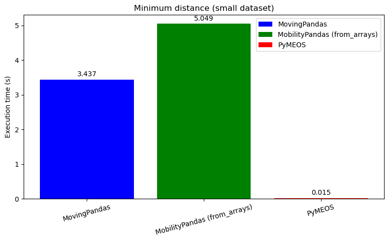

# Benchmark of MovingPandas vs. MobilityPandas on AIS Trajectories

## Abstract
This document presents a benchmark comparing **MovingPandas** with **MobilityPandas** (using **PyMEOS** backend) on AIS trajectory data. We measure performance, fidelity, speed, and memory usage when applying different trajectory functions over three dataset sizes.

## Introduction

[**MovingPandas**](https://movingpandas.org/) is a Python library for trajectory data exploration and analysis. It is based on Pandas, GeoPandas, and HoloViz. It builds a `TrajectoryCollection` of `Trajectory` objects. 

[**MobilityPandas**](https://github.com/MobilityDB/MobilityPandas) is a fork of MovingPandas using PyMEOS as a backend. [Pymeos](https://pymeos.readthedocs.io/en/latest/) is a Python library built on top of [MEOS (Mobility Engine, Open Source)](https://www.libmeos.org/), a C library which enables the manipulation of temporal and spatio-temporal data based on [MobilityDB](https://mobilitydb.com/)'s data types and functions. MobilityPandas converts the `TrajectoryCollection` into `TGeomPointSeq` objects via the PyMEOS backend, makes the calculation, and then converts the obtained `TGeomPointSeq` objects into a `TrajectoryCollection`.  
This benchmark compares the two libraries.  

## Data  
Marine vessel traffic is routinely recorded via Automatic Identification System (AIS), producing high-frequency spatio-temporal point streams. 
- **Source**: AIS vessel positions provided by the Danish Maritime Authority : http://aisdata.ais.dk/   
- **Attributes**: `mmsi`, `timestamp`, `longitude`, `latitude`.  
The MMSI is the id of the observed ship.  
- **Preprocessing**:  
  1. Extract data from a `csv` file and store it in a `pandas.DataFrame` object.
  1. Filter out invalid coordinates.   
  2. Sort by `mmsi`, then `timestamp` and filter out duplicates.  
  3. Project the longitude/latitude coordinates (EPSG:4326) to **EPSG:25832** (UTM zone 32N) for metric distance calculations.  
- **Sizes**:
  We use "small", "medium" and "large" datasets that mean 100,000, 1,000,000 and 4 or 5 million points of one day of AIS data. It covers about 3,000 trajectories. The "twenty-trajectories" dataset takes the twenty trajectories that have the highest number of points on two consecutive days of AIS data, in their entirety. Note that some of them are complete standstill.

## Environment
- **Hardware**:  
- CPU: AMD Ryzen 5 7520U with Radeon Graphics  
  - Base frequency: 400 MHz  
  - Max frequency: 4384 MHz  
- RAM: 7.3 GB  
- Storage: 61.4 GB SSD  

- **Software**:  
  - OS: Linux Ubuntu 24.04
  - libraries: 
    - Python: 3.11.13  
    - MovingPandas: 0.22.4  
    - MobilityPandas: 0.12  
    - PyMEOS: 1.3.0a1 with "add from arrays constructor" commit  
    - PyMEOS-CFFI: 1.2.0 with "add from arrays constructor" commit 
    - GeoPandas: 1.0.1  
    - pandas: 2.2.3  
    - numpy: 1.26.4  
    - MEOS: 1.3.0dev

## Tested Functions  

  - Douglas–Peucker algorithm with time consideration (parameter tolerance (or distance): 1 m) [(see more)](https://research-portal.uu.nl/en/publications/topdowntimeratio-top-down-time-ratio-segmentation-for-coordinate-)  
  - Douglas–Peucker algorithm (parameter tolerance (or distance): 1 m) [(see more)](https://en.wikipedia.org/wiki/Ramer%E2%80%93Douglas%E2%80%93Peucker_algorithm)  
  - Minimum distance algorithm (chosen distance: 1 m) [(see more)](https://mobilitydb.github.io/MobilityDB/master/ch09.html#ttype_simplification)  
  - Minimum time delta algorithm (chosen time delta: 10 s) [(see more)](https://mobilitydb.github.io/MobilityDB/master/ch09.html#ttype_simplification)  
  - Hausdorff distance [(see more)](https://en.wikipedia.org/wiki/Hausdorff_distance)  

## Results

### Simplification

#### Metrics
We measure for each run:
1. **Execution time**: Each function is executed 6 times. We discard the minimum and maximum runtimes as outliers, and compute mean and standard deviation over the remaining 4 runs. Execution time is measured via the function `process_time()` of `time` library, which measures only the CPU time.    
2. **Memory usage** via `memory_profiler` library.  
3. **Spatial–temporal distortion** between the simplified and the original trajectory  (see [Mobility Data Science](https://link.springer.com/book/10.1007/978-3-031-82636-8), section 10.1.5)  
4. percentage of **Points retained**   
5. **Trajectory length difference** with the original trajectory 

#### Douglas-Peucker with time consideration algorithm

[Code available here](simplify_dpt.ipynb)

**Small dataset (100,000 points)**  
- **MovingPandas**  
  - Points retained: 49.13 %   
  - Maximum distortion: 0.04 h*m, average distortion: 0.01 h\*m  
  - Maximum length difference: 13.04 m, average length difference: 0.5 m  
- **MobilityPandas**  
  - Points retained: 58.78 %  
  - Maximum distortion: 0.04 h*m, average distortion: 0.01 h\*m  
  - Maximum length difference: 13.04 m, average length difference: 0.49 m  
- **PyMEOS**  
  - Points retained: 52.51 %  
  - Maximum distortion: 0.04 h*m, average distortion: 0.01 h\*m  
  - Maximum length difference: 13.04 m, average length difference: 0.5 m 

- **Time and memory performance**  

     

**Medium dataset (1,000,000 points)**  
- **MovingPandas**  
  - Points retained: 44.88 %   
  - Maximum distortion: 0.42 h*m, average distortion: 0.11 h\*m  
  - Maximum length difference: 97.66 m, average length difference: 2.96 m  
- **MobilityPandas**  
  - Points retained: 58.19 %  
  - Maximum distortion: 0.42 h*m, average distortion: 0.08 h\*m  
  - Maximum length difference: 97.66 m, average length difference: 2.74 m  
- **PyMEOS**  
  - Points retained: 44.94 %  
  - Maximum distortion: 0.41 h*m, average distortion: 0.10 h\*m  
  - Maximum length difference: 97.66 m, average length difference: 2.96 m  

- **Time and memory performance**

   

**Large dataset (4,000,000 points)**  
- **MovingPandas**  
  - Points retained: 44.59 %   
  - Maximum distortion: 1.91 h*m, average distortion: 0.55 h\*m  
  - Maximum length difference: 490.47 m, average length difference: 12.56 m  
- **MobilityPandas**  
  - Points retained: 60.67 %  
  - Maximum distortion: 1.72 h*m, average distortion: 0.29 h\*m  
  - Maximum length difference: 309.85 m, average length difference: 8.44 m  
- **PyMEOS**  
  - Points retained: 44.52 %  
  - Maximum distortion: 1.6 h*m, average distortion: 0.42 h\*m  
  - Maximum length difference: 401.51 m, average length difference: 10.31 m  

     

**Twenty trajectories dataset**
- **MovingPandas**  
  - Points retained: 18.79 %  
  - Maximum distortion: 346.83 h*m, average distortion: 64.01 h\*m  
  - Maximum length difference: 1906.81 m, average length difference: 218.96 m  
- **MobilityPandas**  
  - Points retained: 70.04 %  
  - Maximum distortion: 344.93 h*m, average distortion: 51.7 h\*m  
  - Maximum length difference: 578.52 m, average length difference: 93.22 m  
- **PyMEOS**  
  - Points retained: 18.79 %  
  - Maximum distortion: 339.15 h*m, average distortion: 61.89 h\*m  
  - Maximum length difference: 1906.81 m, average length difference: 218.96 m  

    

**Partial conclusion**  

Regarding fidelity and reduction, the two libraries have very similar performance. MobilityPandas is a slightly more fidelitous for large datasets, and MovingPandas simplifies slightly better the trajectories. But MobilityPandas is at least three times more efficient for memory usage, and about ten times faster for large datasets.

#### Basic Douglas-Peucker algorithm

[Code available here](<simplify_dp .ipynb>)

**Small Dataset (100,000 points)**  
- **MovingPandas**  
  - Points retained: 36.71 %   
  - Maximum distortion: 10.83 h*m, average distortion: 0.05 h\*m  
  - Maximum length difference: 40.72 m, average length difference: 0.8 m  
- **MobilityPandas**  
  - Points retained: 36.71 %  
  - Maximum distortion: 10.83 h*m, average distortion: 0.05 h\*m  
  - Maximum length difference: 40.72 m, average length difference: 0.8 m  
- **PyMEOS**  
  - Points retained: 30.34 %  
  - Maximum distortion: 13.39 h*m, average distortion: 0.04 h\*m  
  - Maximum length difference: 40.72 m, average length difference: 0.83 m  

- **Time and memory performance**  

      

**Medium Dataset (1,000,000 points)**  
- **MovingPandas**  
  - Points retained: 32.34 %   
  - Maximum distortion: 1,640.07 h*m, average distortion: 1.46 h\*m  
  - Maximum length difference: 1,100.64 m, average length difference: 5.74 m  
- **MobilityPandas**  
  - Points retained: 32.34 %  
  - Maximum distortion: 1,640.07 h*m, average distortion: 1.46 h\*m  
  - Maximum length difference: 1,100.64 m, average length difference: 5.74 m  
- **PyMEOS**  
  - Points retained: 20.5 %  
  - Maximum distortion: 11,075.46 h*m, average distortion: 4.5 h\*m  
  - Maximum length difference: 1,100.64 m, average length difference: 6.02 m  

- **Time and memory performance**

       

**Large Dataset (5,000,000 points)**  
- **MovingPandas**  
  - Points retained: 33.63 %   
  - Maximum distortion: 23,342.66 h*m, average distortion: 9.29 h\*m  
  - Maximum length difference: 17,308.57 m, average length difference: 25.57 m  
- **MobilityPandas**  
  - Points retained: 33.38 %  
  - Maximum distortion: 23,342.21 h*m, average distortion: 8.52 h\*m  
  - Maximum length difference: 17,308.57 m, average length difference: 21.97 m  
- **PyMEOS**  
  - Points retained: 19.65 %  
  - Maximum distortion: 136,955.73 h*m, average distortion: 48.89 h\*m  
  - Maximum length difference: 17,308.57 m, average length difference: 29.32 m  

    

**Twenty trajectories dataset**
- **MovingPandas**  
  - Points retained: 52.12 %   
  - Maximum distortion: 345437.89 h*m, average distortion: 35725.76 h\*m  
  - Maximum length difference: 8391120.56 m, average length difference: 419716.39 m  
- **MobilityPandas**  
  - Points retained: 4.99 %  
  - Maximum distortion: 345437.89 h*m, average distortion: 35725.76 h\*m  
  - Maximum length difference: 8391120.56 m m, average length difference: 419716.39 m  
- **PyMEOS**
  - Points retained: 52.12 %  
  - Maximum distortion: 379728.23 h*m, average distortion: 47593.59 h\*m  
  - Maximum length difference: 8391271.93 m, average length difference: 419903.54 m  

     

**Partial conclusion**  

MobilityPandas retains less points than MovingPandas and is far less fidelitous. But MobilityPandas is about hundred times more efficient for memory usage, and at least 1.5 times faster. To compare the two libraries with a same fidelity, we should use different tolerance parameters.

#### Minimum distance algorithm

[Code available here](simplify_mindist.ipynb)

**Small Dataset (100,000 points)**  
- **MovingPandas**  
  - Points retained: 64.73 %   
  - Maximum distortion: 16.06 h*m, average distortion: 0.03 h\*m  
  - Maximum length difference: 13.04 m, average length difference: 0.65 m  
- **MobilityPandas**  
  - Points retained: 76.07 %  
  - Maximum distortion: 0.16 h*m, average distortion: 0.01 h\*m  
  - Maximum length difference: 13.04 m, average length difference: 0.64 m   
- **PyMEOS**  
  - Points retained: 68.11 %  
  - Maximum distortion: 16.06 h*m, average distortion: 0.02 h\*m  
  - Maximum length difference: 13.04 m, average length difference: 0.65 m  

- **Time and memory performance**  

    

**Medium Dataset (1,000,000 points)**  
- **MovingPandas**  
  - Points retained: 59.62 %   
  - Maximum distortion: 7,002.31 h*m, average distortion: 3.18 h\*m  
  - Maximum length difference: 116.17 m, average length difference: 4.32 m  
- **MobilityPandas**  
  - Points retained: 75.1 %  
  - Maximum distortion: 11.97 h*m, average distortion: 0.11 h\*m  
  - Maximum length difference: 114.53 m, average length difference: 3.96 m  
- **PyMEOS**  
  - Points retained: 59.66 %  
  - Maximum distortion: 7,002.31 h*m, average distortion: 3.06 h\*m  
  - Maximum length difference: 115.76 m, average length difference: 4.32 m  

- **Time and memory performance**

    

**Large Dataset (3,000,000 points)**  
- **MovingPandas**  
  - Points retained: 58.28 %   
  - Maximum distortion: 22,242.53 h*m, average distortion: 11.44 h\*m  
  - Maximum length difference: 407.65 m, average length difference: 12.08 m  
- **MobilityPandas**  
  - Points retained: 76.88 %  
  - Maximum distortion: 1,833.65 h*m, average distortion: 0.87 h\*m  
  - Maximum length difference: 370.16 m, average length difference: 12.34 m  
- **PyMEOS**  
  - Points retained: 58.37 %  
  - Maximum distortion: 22,242.52 h*m, average distortion: 11.1 h\*m  
  - Maximum length difference: 406.82 m, average length difference: 12.07 m  

     

**Twenty trajectories dataset**  
- **MovingPandas**  
  - Points retained: 36.65 %   
  - Maximum distortion: 360,402.76 h*m, average distortion: 18,161.53 h\*m  
  - Maximum length difference: 3,119.44 m, average length difference: 321.76 m  
- **MobilityPandas**  
  - Points retained: 89.18 %  
  - Maximum distortion: 88,776.34 h*m, average distortion: 4,528.47 h\*m  
  - Maximum length difference: 690.84 m, average length difference: 109.35 m  
- **PyMEOS**  
  - Points retained: 36.63 %  
  - Maximum distortion: 360,403.02 h*m, average distortion: 18,147.88 h\*m  
  - Maximum length difference: 3,116.8 m, average length difference: 321.63 m  

     

**Partial conclusion**  

MobilityPandas is faster and more efficient regarding memory usage than MovingPandas.

#### Minimum time delta algorithm

[Code available here](simplify_mintimedelta.ipynb)

**Small Dataset (100,000 points)**  
- **MovingPandas**  
  - Points retained: 71.1 %   
  - Maximum distortion: 1.1 h*m, average distortion: 0.02 h\*m  
  - Maximum length difference: 32.73 m, average length difference: 0.35 m  
- **MobilityPandas**  
  - Points retained: 68.45 %  
  - Maximum distortion: 0.48 h*m, average distortion: 0.02 h\*m  
  - Maximum length difference: 45.46 m, average length difference: 0.51 m  
- **PyMEOS**  
  - Points retained: 59.74 %  
  - Maximum distortion: 1.2 h*m, average distortion: 0.01 h\*m  
  - Maximum length difference: 45.46 m, average length difference: 0.55 m  

- **Time and memory performance**  

    

**Medium Dataset (1,000,000 points)**  
- **MovingPandas**  
  - Points retained: 73.09 %   
  - Maximum distortion: 2,599.42 h*m, average distortion: 0.62 h\*m  
  - Maximum length difference: 237,883.66 m, average length difference: 47.37 m  
- **MobilityPandas**  
  - Points retained: 72.59 %  
  - Maximum distortion: 2,642.77 h*m, average distortion: 0.63 h\*m  
  - Maximum length difference: 237,883.66 m, average length difference: 87.26 m  
- **PyMEOS**  
  - Points retained: 56.46 %  
  - Maximum distortion: 2,642.84 h*m, average distortion: 0.65 h\*m  
  - Maximum length difference: 237,883.66 m, average length difference: 87.84 m  

- **Time and memory performance**

    

**Large Dataset (5,000,000 points)**  
- **MovingPandas**  
  - Points retained: 73.23 %   
  - Maximum distortion: 35,106.56 h*m, average distortion: 8.13 h\*m  
  - Maximum length difference: 5,001,223.14 m, average length difference: 1,640.08 m  
- **MobilityPandas**  
  - Points retained: 74.87 %  
  - Maximum distortion: 34,560.86 h*m, average distortion: 7.79 h\*m  
  - Maximum length difference: 4,422,201.69 m, average length difference: 1,264.66 m  
- **PyMEOS**  
  - Points retained: 56.26 %  
  - Maximum distortion: 34,927.4 h*m, average distortion: 7.95 h\*m  
  - Maximum length difference: 4,422,201.69 m, average length difference: 1,268.24 m  

     

**Twenty trajectories dataset**  
- **MovingPandas**  
  - Points retained: 50.73 %   
  - Maximum distortion: 87,843.62 h*m, average distortion: 4,523.37 h\*m  
  - Maximum length difference: 1,681,743.02 m, average length difference: 84,211.15 m 
- **MobilityPandas**  
  - Points retained: 73.91 %  
  - Maximum distortion: 42,202.77 h*m, average distortion: 3,494.88 h\*m  
  - Maximum length difference: 15,099,980.19 m, average length difference: 755,077.28 m  
- **PyMEOS**  
  - Points retained: 14.81 %  
  - Maximum distortion: 277,958.07 h*m, average distortion: 15,299.24 h\*m  
  - Maximum length difference: 21,826,949.59 m, average length difference: 1,091,528.26 m  

 

**Partial conclusion**  

MobilityPandas reduces more the trajectories, is faster and is more efficient regarding memory usage than MovingPandas. Regarding fidelity, both libraries have similar performance.

#### Conclusion for simplification algorithms

For all simplification algorithms, MobilityPandas outperforms MovingPandas in both speed and memory efficiency. Fidelity and simplification performance are different depending on the algorithm.

### Reduction
### Similarity
#### Hausdorff distance

[Code available here](simil_hausdorff.ipynb)

The two libraries give often the same results, so we only show time and memory performance. But MovingPandas uses the symmetrical version of Hausdorff distance algorithm, whereas PyMEOS uses the unidirectional one, so PyMEOS can give higher values. (see the two different definitions of Hausdorff distance in [this article](https://summergeometry.org/sgi2021/robust-computation-of-the-hausdorff-distance-between-triangle-meshes/))

**Small Dataset (100,000 points)**  

   

**Medium Dataset (1,000,000 points)**  

    

**Large Dataset (4,000,000 points)**  

    

**Twenty trajectories dataset**  
     

## Conclusion

For [basic Douglas-Peucker](#basic-douglas-peucker-algorithm), [Douglas-Peucker with time consideration](#douglas-peucker-with-time-consideration-algorithm), [minimum distance](#minimum-distance-algorithm) and [Hausdorff distance](#hausdorff-distance) algorithms, if we use large trajectories, MobilityPandas is more efficient regarding execution time than MovingPandas, but less regarding memory usage. For [minimum time delta](#minimum-time-delta-algorithm) algorithm, it is the contrary. Note that the very major part of the time used by MobilityPandas is only due to the conversion of the trajectories, especially `TGeomPointSeq` to `TrajectoryCollection`.  
The following graphes summerize the results of this benchmark.

   
   
   
   

   
   
   
   
