# Benchmark of MovingPandas vs. MobilityPandas on AIS Trajectories

## Abstract
This document presents a benchmark comparing **MovingPandas** with **MobilityPandas** (using **PyMEOS** backend) on AIS trajectory data. We measure performance, fidelity, speed, and memory usage when applying different trajectory functions over three dataset sizes.

<!-- ## Table of Contents
1. [Introduction](#introduction)  
2. [Data](#data)  
3. [Environment](#environment)  
4. [Methods](#methods)  
   1. [Coordinate Projection](#coordinate-projection)  
   2. [Trajectory Construction](#trajectory-construction)  
   3. [Functions Applied](#functions-applied)  
   4. [Benchmark Protocol](#benchmark-protocol)  
5. [Metrics](#metrics)  
6. [Results](#results)  
   1. [Small Dataset](#small-dataset)  
   2. [Medium Dataset](#medium-dataset)  
   3. [Large Dataset](#large-dataset)  
   4. [Overall Ranking](#overall-ranking)  
7. [Discussion](#discussion)  
8. [Conclusion](#conclusion)  
9. [Code and Data Availability](#code-and-data-availability)  
10. [References](#references)  

--- -->

## Introduction
We benchmark two Python-based libraries:
- **MovingPandas**: builds a `TrajectoryCollection` of `Trajectory` objects.  
- **MobilityPandas**: constructs a `TGeomPointSeq` via the PyMEOS backend. 

We compare them on:
- Simplification  <!-- (with Douglas–Peucker algorithm),   -->
- Other trajectory functions  <!-- (TODO: list other functions),   -->
over datasets of different sizes.

## Data  
Marine vessel traffic is routinely recorded via Automatic Identification System (AIS), producing high-frequency spatio-temporal point streams. 
- **Source**: AIS vessel positions provided by the Danish Maritime Authority : https://web.ais.dk/aisdata/  
- **Attributes**: `mmsi`, `timestamp`, `longitude`, `latitude`.  
The MMSI is the id of the observed ship.  
- **Preprocessing**:  
  1. Filter out invalid coordinates.   
  2. Sort by `mmsi`, then `timestamp` and filter out duplicates.  
  3. Project the longitude/latitude coordinates (EPSG:4326) to **EPSG:25832** (UTM zone 32N) for metric distance calculations.  
  4. Constructing the trajectories.  

## Environment
- **Hardware**:  
  - CPU: TODO (e.g., Intel Core i7‑9700K @ 3.6 GHz)  
  - RAM: TODO GB  
  - Storage: TODO SSD  
- **Software**:  
  - Python: 3.11.13  
  - MovingPandas: 0.22.4  
  - MobilityPandas: 0.12  
  - PyMEOS: 1.3.0a1  
  - PyMEOS-CFFI: 1.2.0  
  - GeoPandas: 1.0.1  
  - pandas: 2.2.3  
  - numpy: 1.26.4  
  - MEOS: 1.3.0dev
  <!-- TODO -->

## Methods

### Trajectory Construction
1. **MovingPandas**  
<!-- TODO -->

2. **MobilityPandas**  
   We build the trajectories using the `from_arrays` method, then `from_instants` method. This protocol is faster than constructing the instants individually and then using `from_instants`. 
   <!-- TODO : ajouter le lien vers la démo. -->
   In this way, we build a dataframe of TGeomPoint objects.

### Tested Functions  
- **Trajectory simplification**: Douglas–Peucker with time consideration  
  - Parameter tolerance (or distance) = 1 
  <!-- TODO meters   -->
<!-- - **Other functions**:   -->
  <!-- - TODO: list and describe   -->

### Benchmark Protocol
- Each function is executed 6 times.  
- We discard the minimum and maximum runtimes as outliers.  
- We compute mean and standard deviation over the remaining 4 runs.  
- Memory usage is measured via `memory_profiler` library.  
 

## Results

### Simplification

#### Metrics
We measure for each run:
1. **Execution time**  
2. **Memory usage**   
3. **Spatial–temporal distortion** between the simplified and the original trajectory 
4. percentage of **Points retained**   
5. **Trajectory length difference** with the original trajectory 

#### Small Dataset  
100,000 points  
- **MovingPandas**  
  - Points retained: 49.13 %   
  - Maximum distortion: 0.04 h*m, average distortion: 0.01 h\*m  
  - Maximum length difference: 13.04 m, average length difference: 0.5 m  
- **MobilityPandas**  
  - Points retained: 52.51 %  
  - Maximum distortion: 0.04 h*m, average distortion: 0.01 h\*m  
  - Maximum length difference: 13.04 m, average length difference: 0.5 m  

- **Time and memory performance**  

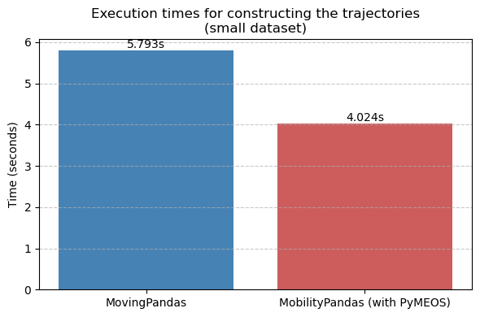    |    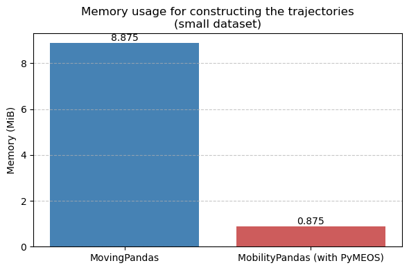
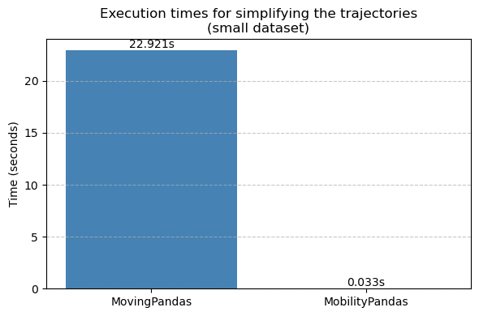     |   
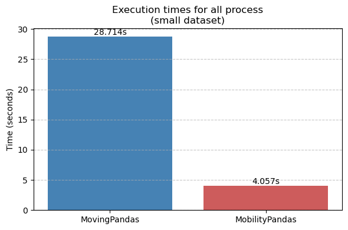

#### Medium Dataset
1,000,000 points
- **MovingPandas**  
  - Points retained: 44.88 %   
  - Maximum distortion: 0.42 h*m, average distortion: 0.11 h\*m  
  - Maximum length difference: 97.66 m, average length difference: 2.96 m  
- **MobilityPandas**  
  - Points retained: 44.94 %  
  - Maximum distortion: 0.41 h*m, average distortion: 0.10 h\*m  
  - Maximum length difference: 97.66 m, average length difference: 2.96 m  

- **Time and memory performance**

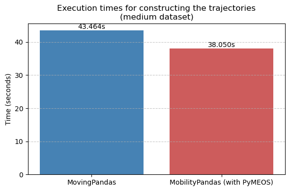    |    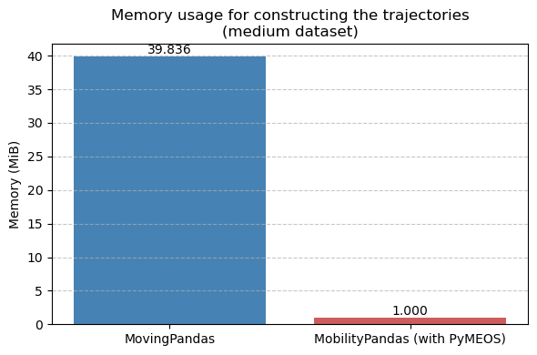  
     |     
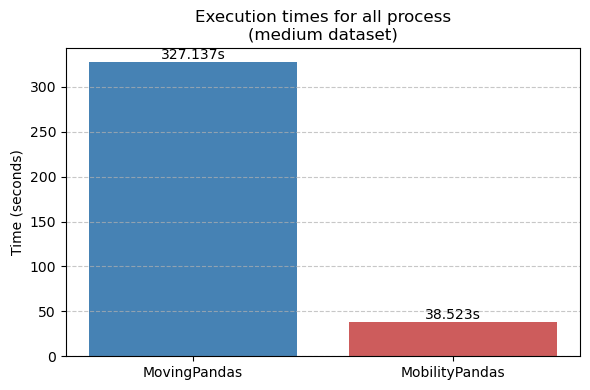

#### Large Dataset
10,000,000 points 
- **MovingPandas**  
  - Points retained: 44.59 %   
  - Maximum distortion: 1.91 h*m, average distortion: 0.55 h\*m  
  - Maximum length difference: 490.47 m, average length difference: 12.56 m  
- **MobilityPandas**  
  - Points retained: 44.60 %  
  - Maximum distortion: 1.83 h*m, average distortion: 0.51 h\*m  
  - Maximum length difference: 490.47 m, average length difference: 12.56 m  

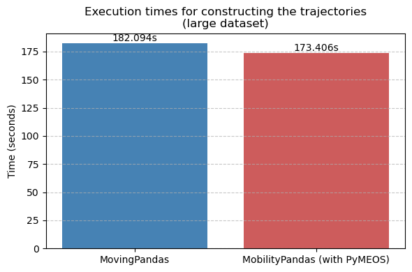    |    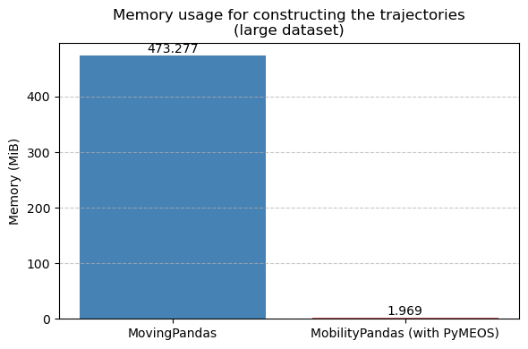  
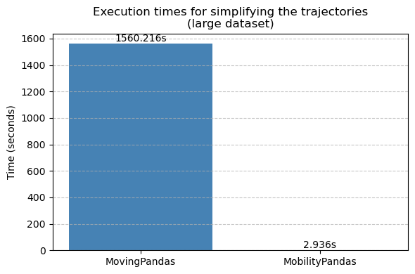     |   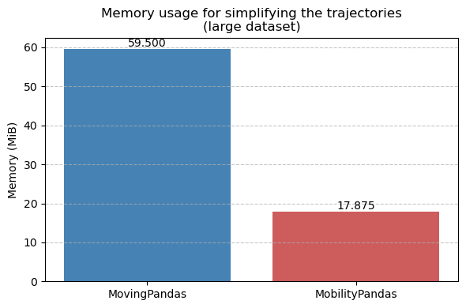  
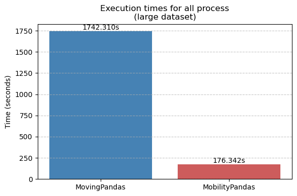

### Overall Ranking
| Criterion                 | Winner            | Notes                    |
|---------------------------|-------------------|--------------------------|
| Speed                     | MobilityPandas    |   important difference   |
| Memory Efficiency         | MobilityPandas    |   important difference   |
| Fidelity                  | MobilityPandas    |   slight difference      |
| Simplification            | MovingPandas      |   slight difference      |

## Discussion
<!-- - Trade‐off between execution speed and spatial fidelity.  
- Impact of pymeos backend on vectorized operations.  
- TODO: interpret results, link to theory and prior work. -->

## Conclusion
<!-- Summarize main findings:
- MobilityPandas outperforms on …  
- MovingPandas remains preferable when … -->

## Code and Data Availability
- **Notebook**: [Benchmark Analysis (GitHub link)](TODO link)  
- **Dataset**:  

## References  
TODO
<!-- 1. Douglas, D., & Peucker, T. (1973). Algorithms for the Reduction of the Number of Points Required to Represent a Digitized Line or Its Caricature. *Cartographica*.   -->
