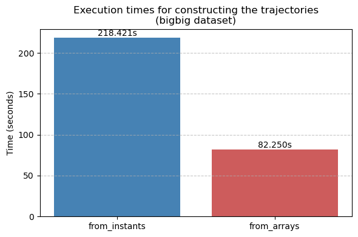
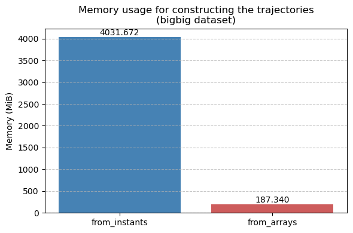
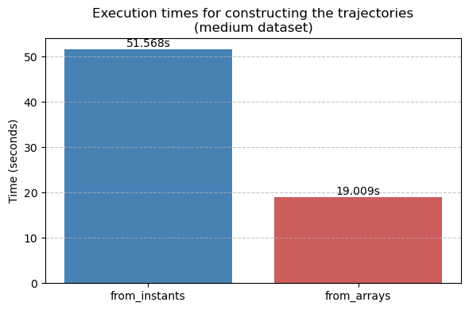
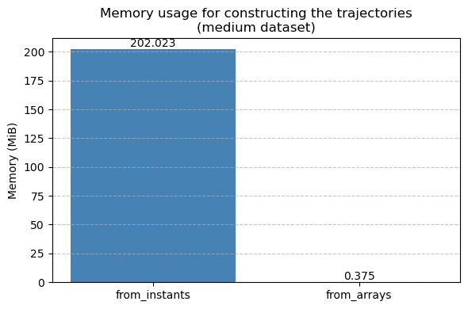
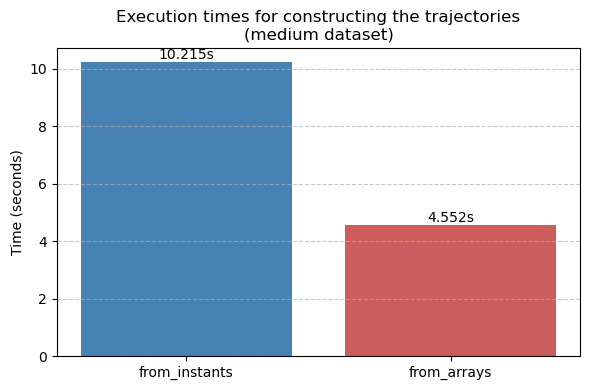

# Quick Comparison: `from_instants` vs `from_arrays` in PyMEOS

This benchmark compares two methods for constructing trajectories using PyMEOS.  
`from_instants` is already implemented in PyMEOS; `from_arrays` is currently not yet implemented in the library.

We use AIS data (https://web.ais.dk/aisdata/)  

The used code can be seen here: https://github.com/SophiedeVirieu/MobilityPandas/blob/update/mpandas-0.12/tutorials/benchmark/demo_from_arrays.ipynb  

## Big dataset (20 million rows)

| Execution time | Memory usage |
|---------------|-------------|
|  |  |

## Medium dataset (5 million rows)

| Execution time | Memory usage |
|---------------|-------------|
|    |    |

## Small dataset (1 million rows)

| Execution time | Memory usage |
|---------------|-------------|
|    |    |

## Conclusion (preliminary)

`from_arrays` is significantly faster, especially on big datasets.  
